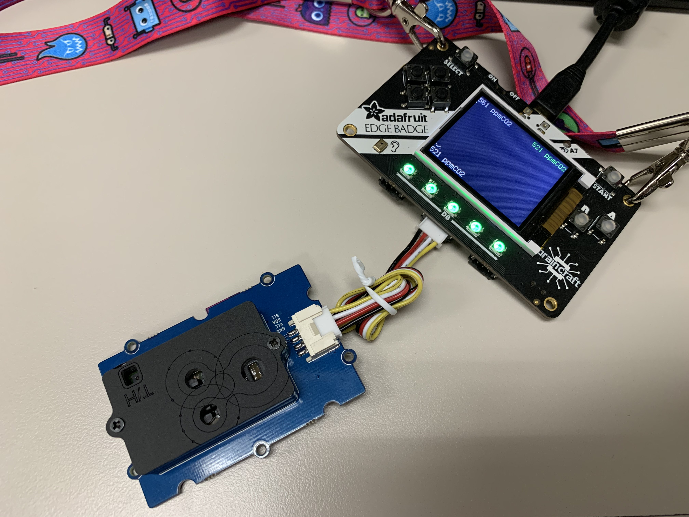
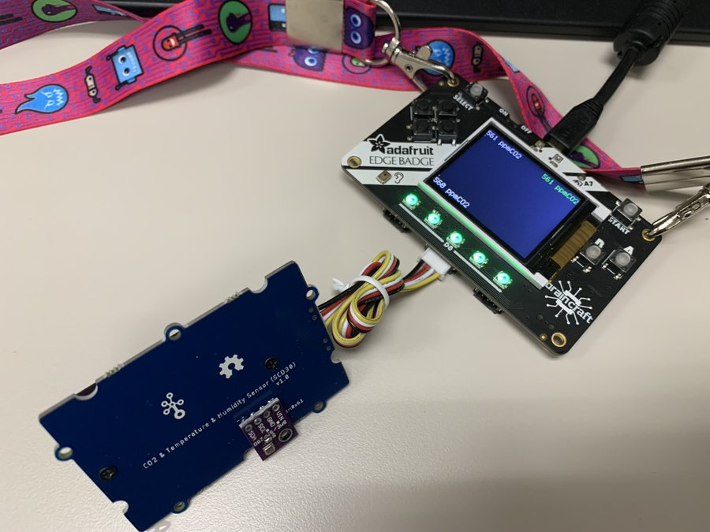

# Supercon 2019 Edge Badge

This is a copy of the code I had running on my [Adafruit Edge Badge](https://blog.adafruit.com/2019/11/04/braincraft-edge-badge-at-supercon-brought-to-you-by-digi-key-and-adafruit-digikey-hackaday-hackadayio-supercon-tensorflow-machinelearning-tinyml-tensorflow/) by the end of Hackaday Supercon 2019.

The main thing it implements is a CO2 logger, but it also supports all the original badge modes (Hello My Name Is, QR code, etc) and additionally implements [LightCommands](https://lightcommands.com/) to calcualte the square root of 2 with a Google Home.

## General badge operation

The default badge code is implemented as a state machine, with physical buttons switching between modes. My changes adopt this same convention.

* **Default (Down button):** Display a CO2 plot with one sample per pixel, every 2s (320s worth of data on a screen, 5 1/3 minutes). Auto-scales, shows latest sample value in green, and high/low of the plot in white.
* **Start button:** Shows "HELLO MY NAME IS XXX ppmCO2"
* **A:** Shows original contact info screen (hey now you have my email address)
* **B:** Shows original QR code screen (links to my website). Also plays "Hey google, what's the square root of 2?" audio file for LightCommands mode.

## CO2 Monitor

The CO2 monitor function is based on a Sensirion SCD30, on a [Seeed Studio grove breakout](https://www.seeedstudio.com/Grove-CO2-Temperature-Humidity-Sensor-SCD30-p-2911.html). This is convenient as the STEMMA port on the Edge Badge is also compatible with Grove cables and connectors. I did not plan this; I just thought the Seeed SCD30 breakout was pretty. 

This sensor is calibrated from the factory, but uses an "Automatic Baseline Calibration" algorithm to correct for drift over time. The sensor, in continuous operation for 7 days, assumes any continuous valleys in the data represent 400ppm ambient air. In a normal HVAC/building air application, people go home for the weekend and the indoor air quickly settles to equilibirium with the ambient outside baseline concentration. This is worth paying attention to if your application will be continously powered, but never exposed to a true ambient baseline over 7 days.

### Pressure Calibration

Non-Dispersive Infrared (NDIR) CO2 sensors count the number of molecules of CO2 in their optical path by total IR absorption. The reported PPM value, however, is ratiometric: mol (CO2)/mol (air). Therefore, the PPM value is actually both temperature and pressure dependent per the ideal gas law PV=nRT. The SCD30 includes temperature measurement and incorporates that automatically, but it doesn't incorporate pressure measurement. (Aside: the measurement is also humdity dependent, because water absorbs IR as well, but the SCD30 includes humidity compensation internally with temperature).

In order to pressure-compensate the output, I found a [BME280 breakout](https://smile.amazon.com/gp/product/B07KYJNFMD/ref=ppx_yo_dt_b_asin_title_o01_s00?ie=UTF8&psc=1) that happens to be pin-compatible with the exposed pins on the back of the SCD30 breakout. It also includes 5V regulation and i2c level shifting, so we can just solder it right on.

**For use without pressure calibration, look at lines 11, 82, and 139/140.**

## LightCommands / Laser Google Home Control

Literally just plug a laser into the speaker jack (a JST 2.0mm variant), and disable the onboard micro speaker by cutting the trace on the solder jumper just south of it. I used [these diodes](https://smile.amazon.com/gp/product/B071FT9HSV/ref=ppx_yo_dt_b_asin_title_o08_s02?ie=UTF8&psc=1) successfully.

The audio file I used was recorded on an iPhone in a quiet area to avoid too much noise, and then sample rate decimated with Audacity down to 20ksps to make it easier for the badge to play. Actually it was to make it easier for my test setup to play, but it seems to work either way.

Playing an audio file out to the laser with a simple class D audio amp like this almost certainly results in a lot of distortion on the output signal. For this reason, noisiness and clairty of the input audio is very important. But it totally works. [Not the badge itself, but still](https://twitter.com/alexwhittemore/status/1196114509531734017).

## Dependencies

The badge, as I have it right now, is running on the latest CircuitPython 4.x

The following libraries should be on your edge badge to begin with:
`adafruit_pybadger, time, machine, board, displayio, terminalio, adafruit_display_text, audioio`

You'll need to add `adafruit_bme280` from the standard circuitpython distribution (Note: Only for CO2 pressure compensation: see section below)

You'll definitely need my CircuitPython port of `scd30` ([GitHub link](https://github.com/alexwhittemore/micropython-scd30)).

## Installation

1) Copy the files in this repo to the root of your Edge Badge
1) get `adafruit_bme280.mpy` from the [official library bundle 4.x](https://circuitpython.org/libraries) or `adafruit_bme280.py` from the [original repo](https://github.com/adafruit/Adafruit_CircuitPython_BME280). Copy the `.mpy` into the 'lib' directory on your badge, or copy the `.py` into the root of your badge (or maybe it works inside 'lib' too?)
1) Same for `adafruit_bme280.mpy` if you're using that library.
1) Copy `scd30.py` from [the scd30 CircuitPython port](https://github.com/alexwhittemore/micropython-scd30) next to `code.py` in your root. Or again, maybe it works inside 'lib' too. 
